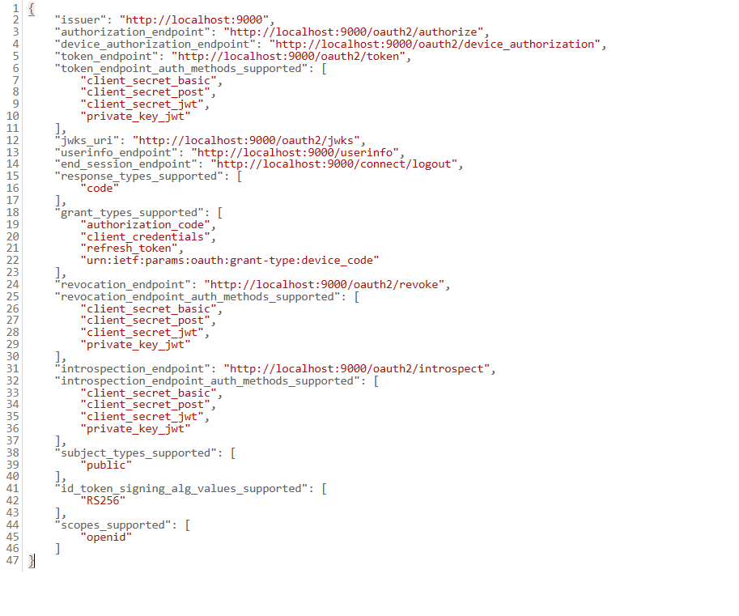

# 09.18.
## Ezen a héten a következőket valósítottam meg:
Ezen a héten a specifikáció pontos leírásán dolgoztam. 
 - Megfogalmaztam a funkcionális követelményeket
- Létrehoztam az adatmodellt, melyhez diagramot is készítettem
- Leírtam az OAuth2 azonosítás folyamatát, architektúráját
- Végiggondoltam a megvalósítás lehetőségeit

A kérdéseimet a Specifikációban piros színnel emeltem ki.

Emellett elkezdtem az autorizációs szerver implementálását. Ehhez elkészítettem az adatmodellhez illeszkedő adatbázis sémát MySql 8 adatbázissal. Létrehoztam egy Spring Boot projektet, és kapcsolódtam az adatbázishoz. Flyway segítségével biztosított az adatmigráció (db inicializálás), így más gépről is kevés beállítással futtatható.
Az entitások és a repository-k váza is elkészült.
Továbbá egy kezdetleges Security beállítást is hozzáadtam, ami jelenleg az automatikusan generált login formmal működik, postman-nel kipróbálható.
A klienseket már az adatbázisból éri el, azonban a felhasználók még csak inmemory vannak.
A token-t is még személyre kell szabni.

# 09.24.
## Ezen a héten a következőket valósítottam meg:
A héten az AS-rel foglalkoztam, sok mindent kiderítettem, nagyon sokat debuggoltam.
Felfedeztem, hogy működik rajta az összes openid endpoint. A jelenlegi beállítás is megtekinthető: 

Először sikerült PostMan-nel megvalósítani, hogy működjön a Client Secret Basic azonosítás.

Ezután kitaláltam egy módszert a bejelentkezés egy másik személy nevében lehetőségre, ekkor a kliens extra paraméterben kéri az imitálni kívánt felhasználót (mimic: username), PostMan-nel ez is működött.

Végül létrehoztam az Angular frontend klienst. Eközben azt az ajánlást olvastam, hogy SPA klienseknél ez a metódus nem javasolt, ehelyett a Public client metódust kell használni. Találtam egy megfelelő könyvtárat, mellyel könnyen megvalósítható a kliens oldal: angular-auth-oidc-client. Hosszas próbálkozás után végre sikerült a bejelentkezést megvalósítani. (igaz még csak egy gomb, de működik)

Tehát a jelenlegi státusz: kezdetlegesen működik az auth server és a kliens be tud jelentkezni. Van rendes mysql db a szerver mögött, és azt is használja, az access token személyre szabott, visszaadja az azonosított felhasználó összes (publikus) adatát. Emellett néhány külön endpoint van még mint resource a szerveren, ami majd az adminoknak lesz elérhető.

# 10.01.
## Ezen a héten a következőket valósítottam meg:
### Authorizáció update:
- van saját személyre szabott userinfo protocol endpoint
- a megszemélyesítés act_as paraméterrel megadható, ehhez megfelelő tokent ad vissza
- plusz csináltam email service-t :) ez regisztráció után email validációs linket küld, és csak ezzel válik sikeressé a regisztráció
- csináltam néhány (cseppet sem kimerítő) tesztet

### Regisztrációs oldal:
- saját Bootstrap 5-ös login és regisztrációs oldalakat készítettem ThymeLeaf template-ek segítségével és ehhez megfelelő kontrollereket
- alapvető input ellenőrzés és hibakezelés: kötelező mezők kitöltése, username egyedi legyen
- külön visszajelzés sikeres és sikertelen regisztráció esetén
  
### Frontend:
- Angular Material elemeket felhasználva elkészítettem az alkalmazás vázát: module, routing, néhány (üres) oldal
- elkészült a login komponens, hozzá tartozó szerviz, login után megjelenik a profil ikon, a userinfo
- logout működik
- login után, ha a szerepkör megengedi, a megszemélyesítés opció megjelenik, és a kiválasztott névre klikkelve automatikusan átjelentkezik abba a profilba
- hozzáadtam egy interceptort, ez az access tokent felteszi minden kérésre
- van egy mindenhonnan elérhető UserInfo model osztály, ami a bejelentkezés eseményét publikálja, és az aktuális user adatait elérhetővé teszi

# 10.08.
## Ezen a héten a következőket valósítottam meg:

### Frontend
- kicsit szebb
- van külön oldal a játékoknak: itt listázva megjelennek külön tabfüleken a tanár/kutató/rendszer által ajánlott játékok és az összes játék
- egyelőre mockolt adatokkal működik, de a data flow már teljesen ki van alakítva
- lokalizáltam a sztringeket, így egy helyen van gyűjtve az összes üzenet, amit az alkalmazás megjelenít
- sikerült integrálni a játékokat, beillesztettem Csaba szkriptjét, és az elkészült játékokat az Angular projektbe: egy külön komponens jeleníti meg, külön rout-on érhető el
- sikerült összekötni a mockolt adatokkal, és így paraméterezetten elindítani a játékokat, hozzáadtam egyszerű hibakezelést is

### Backend - Resource server
- a felhasználókkal és profillal kapcsolatos funkciókon dolgoztam
- létrehoztam a resource server projektet, h2 in memory és mysql adatbázisokkal tesztelésre/fejlesztésre külön profilokkal
- felállítottam flyway data migrationt
- létrehoztam az adatmodellt leíró SQL szkriptet, ezt futtatja a flyway
- újragondoltam az adatmodellt, és változtattam néhány dolgon, szerintem így rugalmasabb lesz
- létrehoztam az adatmodellnek megfelelő Entity osztályokat és a köztük lévő kapcsolatokat
- létrehoztam repository-kat, service osztályokat
- készítettem külön DTO osztályokat is a user-hez, a PlainUserDto nem tartalmazza a profilt, míg a UserProfileDto igen
- írtam teszteket a repository-khoz és a service-ekhez, ezek alapján javítottam a hibákat
- létrehoztam a UserController-t, egyelőre csak két metódussal (nem láttam értelmét többnek): GET -> saját profil, PUT -> adminjoggal
- megírtam a security releváns részeit is, ezt azonban egyelőre "kikapcsoltam" a dev és test profilon, mert még nem tudtam tesztelni
- (a controller-ben már kell autentikáció, de ez még nem fog működni az inaktív security miatt)

### Kérdéseim
- most van a resource serveren Role entitás, hozzákapcsolva a User-hez, de szerintem erre nincs szükség, törölhetem?
- gondolkoztam azon, hogyan lehetne minél egyszerűbben megoldani, hogy a képesség különféle típusú lehessen, javaslataim:
 - varchar-ként tárolni az abilityValue-t és felvenni egy abilityType mezőt az Ability-be, ami megadja, hogyan kell értelmezni
 - a ProfileItem-nek lehetnek speciális leszármazottai, különböző típusokkal (de akkor ezeket külön táblán kell tárolni, és egyben a ProfileSnapshotItemnek is lesznek ugyanilyen leszármazottai)
 - lehet többféle abilityValue field-je a ProfileItemnek, és nem mind van kitöltve, ennek megfelelően több nullable oszlopa lenne a táblának is...
- nyilván mindnek van hátránya, nekem most ezek jutottak eszembe, a legjobb megoldás szerintem attól is nagyban függ, hogy a gyakorlatban mennyire lehet sokféle value típusra számítani

# 10.15.
## Ezen a héten a következőket valósítottam meg:
### Resource server:
- refaktoráltam a user és profile adatmodellt és a hozzá tartozó repókat, service-t
- teszteltem a refaktorált osztályok működését
- megírtam a képességekhez kapcsolódó kontroller osztály kódját, ezt is teszteltem
- kijavítottam a játékok adatmodelljét, ehhez létrehoztam az entitásokat, a köztük lévő kapcsolatokat
- elkészítettem a játékmenethez tartozó repository, service, controller és dto osztályokat, ezek működését is teszteltem
- a játékmenetnél működik az autentikáció és a profilsnapshot mentése napi egyszer

### Security update:
- a resource serveren csináltam dev security beállítást, így az auth server éles működése nélkül is lehet tesztelni
- lett egy új role: GAME, ez arra jó, hogy játékmenetek eredményeit jogosult elmenteni (illetve akár biz. user infok lekérdezésére)
- az auth serveren készítettem egy további autentikációs módot a játékok számára: token, amiben a játék id, userinfo és GAME role szerepel
- frontenden is működőképes ez a metódus, de még csak tesztüzemben van

### Kérdéseim:
- jwt token tárolása frontenden: in-memory nem járható, mivel redirect/frissítés esetén kiürül a memória, jó lesz httpOnly cookie? elvileg ez még egész biztonságos
- kell a profilsnapshot mentésnél most foglalkozni azzal, hogy profilozó vagy tréning játékról van szó? Egyáltalán van előrehaladás, hogy mi alapján különböztetjük meg?

### Egyéb:
- a játékok integrálásához A) változat: a beépített játékok beágyazódnak az Angular kliensbe, B) változat: külső játék esetén url-címre redirect + access token?

# 10.23.
## Ezen a héten a következőket valósítottam meg:
### Auth server:
- hozzáadtam néhány funkciót a usermanagement-hez (admin feature), refaktoráltam a service-eket, illetve teszteltem
- a kontakt-kezelést javítottam, hogy frissítés esetén mindkét félnél frissüljön, ezt teszteltem

### Frontend
- az admin oldalt valósítottam meg, azon belül a user-managment részt
- az admin megtekintheti az összes felhasználót, a hozzájuk tartozó szerepköröket, illetve igényelt szerepköröket, ezeket módosíthatja
- a felhasználók minden adata módosítható, a kapcsolatok frissíthetők
- csináltam hozzá autocomplete keresőmezőt is :)
- megoldottam, hogy az oldalakra navigáló gombok csak akkor jelenjenek meg, ha a felhasználó be van jelentkezva, ill. van megfelelő jogosultsága
- az admin feature külön modulban van, az útvonalát guard védi

+sikerült félig meddig összehangolni a 3 komponenst, addig jutottam el, hogy a game kapott tokent, fel is használta a resource szerverhez küldött post-ban
ezen még kell bőven dolgoznom, mert az autentikáció (2 token kezelés) még nem teljesen gördülékeny

### Kérdésem:
Most felmerült bennem az a probléma, hogy a játékoknak adott token mennyi ideig legyen érvényes. Ez elég sarkallatos kérdés, mert túl hosszú lejárat nyilván nem biztonságos, túl rövid ellenben megszakítaná a játékmenetet, plusz a játéknak le kell kezelnie, ha egy idő után a POST-ra forbidden-t kap. Jelenleg csak a frontend tudja újból igényelni a tokent a user token felhasználásával (nincs értelme kiadni a user tokent külső appnak, ez a specifikációban is így van), szóval a játék nem tud új tokent igényelni, csak visszanavigáni a frontendre.
A külső játék tulajdonképp semmiképp nem fog tudni új tokent igényelni, hacsak fel nem szólítja a user-t, hogy jelentkezzen be ott is.
Javaslataim: A) legyen fix ideig érvényes a token (pl. 30 perc) és erre felhívjuk a felhasználó figyelmét, hogy ennyi ideig játszhat egyszerre egy játékkal, utána visszakerül a játékválasztó oldalra. B) Refresh tokent biztosítunk a game-tokenhez, ennek biztonságos tárolását azonban a külső játékoknak felelőssége megoldani. (Ugyanígy a frontend-nek is...)

# 10.29.
## Ezen a héten a következőket valósítottam meg:
### Auth server:
- volt egy-két hiba a tokenek személyre szabásánál: a megszemélyesítés után a game token továbbra is az eredeti felhasználó nevére szólt, illetve az id token nem lett módosítva, ezeket javítottam
- átírtam a html oldalakat magyar szövegűre, illetve teszteltem az email-verifikációt, jól működik :)

### Resource server:
- megoldottam néhány autentikációs problémát: cors konfiguráció, illetve a game-tokeneknél rossz volt az ellenőrzés, nem konzisztens az auth-serverrel, de most már rendben van
- létrehoztam olyan dto osztályokat, amikben lehet rendszer által ajánlott játékokat küldeni, illetve ami megfelel a játékok által eredményként küldött válasznak
- ezek feldolgozására, konvertálására szerviz osztályt is készítettem
- felkonfiguráltam, hogy ki tudja szolgálni a játékok thumbnail képeit

### Frontend:
- sokat kínlódtam a tokenek helyes kezelésével (sajnos sok idő elment azzal, hogy egy redirect után a többi ne vesszen el, és a userinfo is megmaradjon)
- a jelenlegi megoldás úgy tűnik, hogy szépen működik, elviseli az oldalfrissítést, a felhasználóváltást és a game-token megszerzését is
- a frontend számon tartja, amennyiben megszemélyesítés történt, és ennek megfelelően kéri a játék tokeneket, minde egyes játékindításkor újat
- sok mindent refaktoráltam, hogy áttekinthetőbb legyen
- sikerült elérni, hogy valódi backend által db-ből szedett játékok jelenjenek meg, amiket el lehet indítani, érkezik számukra token és a játék választ is küld, a választ pedig a backend fogadja, validálja és menti!!!:D
- csináltam glopbális error-kezelést, ami egy dialógusablakban megjeleníti, ha hiba történt
- végül még pár szépítésre tellett, pl. tettem egy lebegő asztronautát a home-page-re, és minden szöveget kiszerveztem, átírtam magyarra

### Megjegyzések:
- a játéknak vissza kéne küldenie az eredménnyel együtt a config-ját is, hogy ezt is el lehessen menteni

### Kérdés:
- a külső játék indítása milyen módon legyen? megfelelő, ha POST-ban átküldi a frontend a config-ot és ebben a tokent? jelenleg ezt a funkciót adtam hozzá
- nyilván lehetne window.open metódussal megnyitni az url-t, de ott legfeljebb a token-t és egy game-id-t tudunk átküldeni extra adatként és az id alapján utána lekérdezheti a backend-től a részleteket

# 11.06.
## Ezen a héten a következőket valósítottam meg:
- elkezdtem írni a szakdolgozatot, mostantól kezdve ez is a heti teendőim része lesz
  
### Frontend:
- refaktoráltam az admin oldalt, kiegészítettem néhány validátorral a formokat
- megoldottam az állandó NG100-as hibaüzenetet, ami a loginstatus változása miatt volt
- felvettem új guard-okat az útvonalakra
- létrehoztam egy wildcard path-t, ami egy not-found oldalra visz
 #### elkészítettem egy oldalt a kognitív profil megtekintésére:
- itt látható a felhasználó aktuális profilja képességnév-képességérték párokban
- van egy dátumválasztó, ahol meg lehet adni, mely idő-intervallumból származó legfrisebb profil jelenjen meg
- van egy diagram is, ami ábrázolja a kiválasztott időintervalumban lévő képesség-adatok változását
- tanár/kutató/szülő számára van egy "kontaktválasztó", ahol megadhatja, kinek a profilját szeretné megtekinteni, az adatok ez alapján jelennek meg

### Backend:
- a frontend kiszolgálására létrehoztam új kontrollert a képességadatoknak
- ehhez szerviz is készült, ami képes időpontok alapján visszaadni a profilelemek listáját, illetve paging is lehetséges
- feltöltöttem az adatbázist néhány minta profiladattal
- bevezettem külön auth-service-t, melynek feladata 1. a játékok hozzáférésellenőrzése, 2. a felhasználók kontaktellenőrzése (ha pl. egy másik felhasználó profiljáról kér le adatot)

